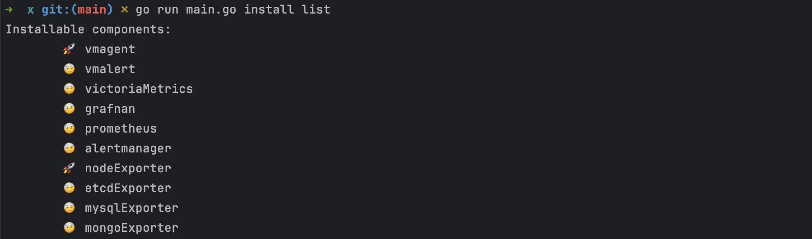

# x
参考架构：


---

所有均二进制安装：当前支持
 

用法构建：

```
    GOOS=linux GOARCH=amd64 go build -o ./bin/
```

准备： 将所需安装二进制文件放在 x 文件的 ./bin 下
示例：

```sh
./x install nodeExporter
```
安装成功显示：
```azure
🎉 Node exporter installed successfully.
```